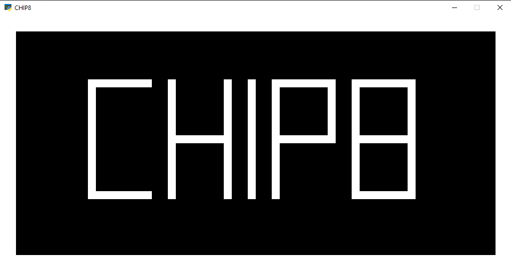

# PyCHIP8: Um Emulador de CHIP-8 Escrito em Python

## Ideia

O objetivo deste projeto é construir um emulador simples de CHIP-8 escrito em Python, capaz de executar ROMs clássicas de CHIP-8.

O emulador implementa a máquina virtual do CHIP-8, incluindo memória, registradores, pilha, gráficos, temporizadores e tratamento de entrada.

O projeto foi criado principalmente para fins de aprendizado, explorando como os emuladores funcionam internamente e como sistemas de baixo nível podem ser reproduzidos em uma linguagem de alto nível como Python.

## Recursos

- Implementação da CPU CHIP-8
- 16 registradores de uso geral
- Suporte a pilha e sub-rotinas
- Renderização SDL2
- Mapeamento de entrada de teclado
- Carregamento de ROM
- Suporte à maioria dos opcodes CHIP-8

## Tecnologias Utilizadas

- Python 3
- PySDL2 (gráficos e entrada)

## Como Executar

1. Instalar dependências
    Instale o Python e as bibliotecas necessárias:

    ```bash
    pip install pysdl2 pysdl2-dll
    ```

    Se você estiver usando o **uv**, execute:

    ```bash
    uv sync
    ```

2. Executar o emulador
    Execute o programa passando uma ROM CHIP-8 como argumento:

    ```bash
    python -m app.main caminho/para/rom.ch8
    ```

    Exemplo:

    ```bash python -m app.main roms/IBM Logo.ch8

    ```

    Se o caminho da ROM contiver espaços, lembre-se de usar aspas:

    ```bash
    python -m app.main "roms/IBM Logo.ch8"

    ```

## Captura de tela



## Próximos passos

Possíveis melhorias para o emulador:

[ ] Criar uma interface de usuário

Leia em inglês:
[README](./README.md)
